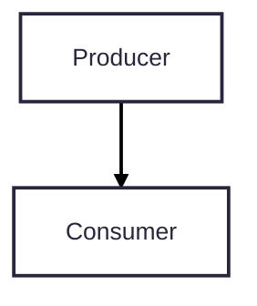
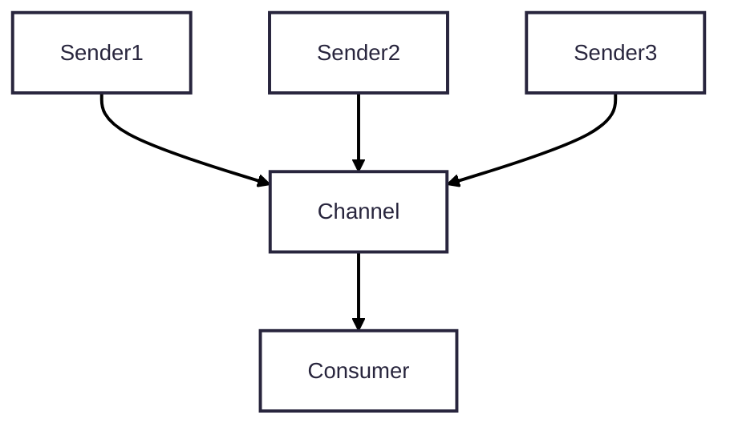
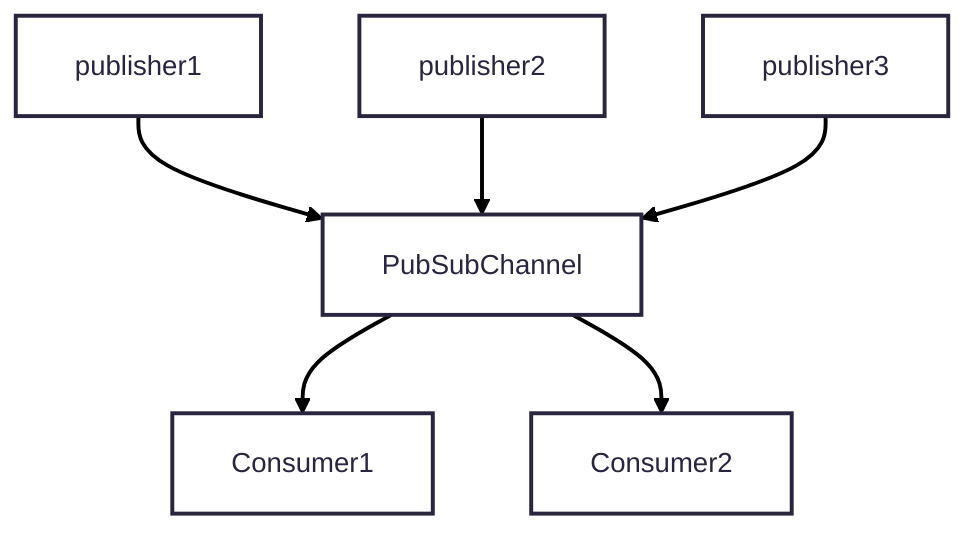

# Embassy Sync Note

- [Signal](https://docs.embassy.dev/embassy-sync/git/default/signal/struct.Signal.html) -> Notify consumer On New Value

- [Channel](https://docs.embassy.dev/embassy-sync/git/default/channel/struct.Channel.html) -> bounded size communication, value is removed after first read by consumer, sender will wait if buffer full.

- [PubSubChannel](https://docs.embassy.dev/embassy-sync/git/default/pubsub/struct.PubSubChannel.html)-> its like Channel but multiple consumer. publisher able to wait or force inserting into buffer, when consumer miss data it will receive an error or it can be ignored.

- [Pipe](https://docs.embassy.dev/embassy-sync/git/default/pubsub/struct.PubSubChannel.html)-> `u8` type writer and reader, only one reader but multiple writer.
