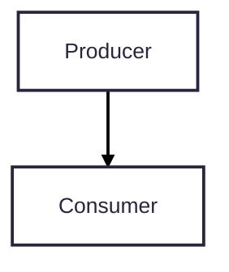
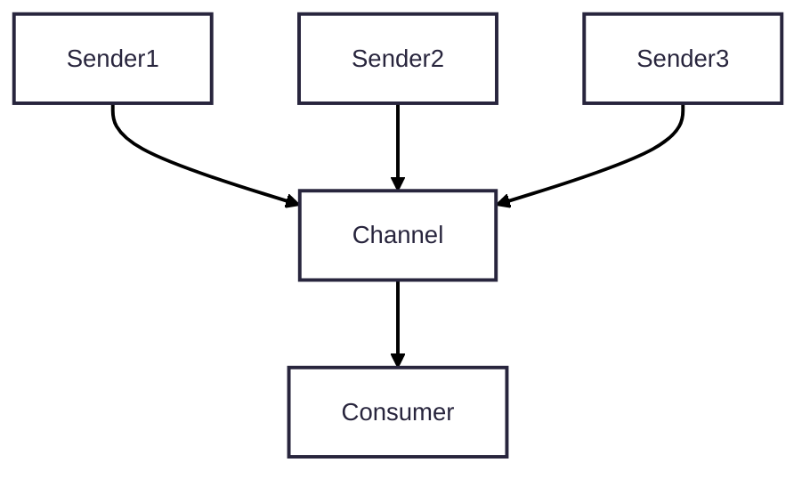
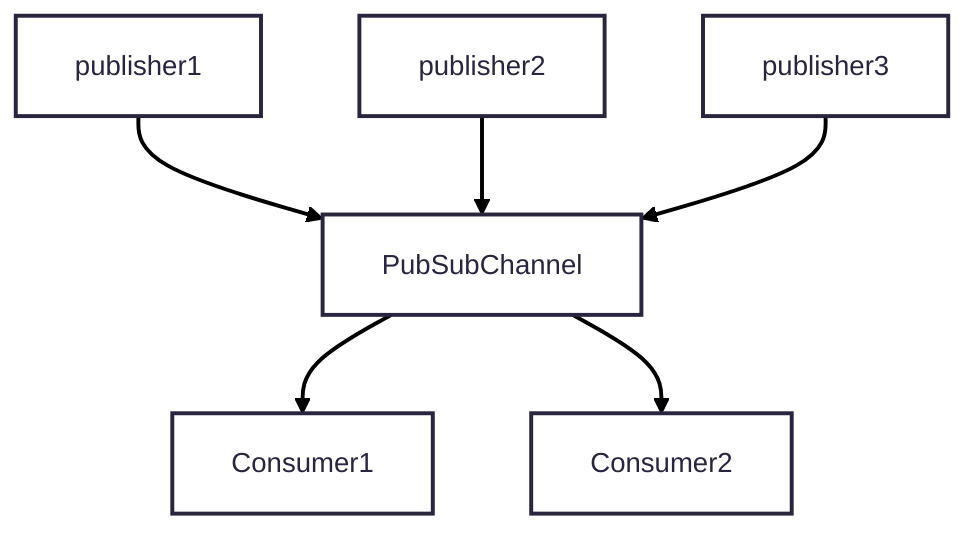

# Embassy Sync Note

- [Signal](https://docs.embassy.dev/embassy-sync/git/default/signal/struct.Signal.html) -> Notify consumer On New Value

you can see example [here](./firmware/src/bin/poc_embassy_sync_signal.rs) 

**example output**

```shell
producing apple Apple { weight: 1179814971, diameter: 661534896 }, 0
producing apple Apple { weight: 2557317973, diameter: 4206275628 }, 1
producing apple Apple { weight: 3070448368, diameter: 2865858565 }, 2
producing apple Apple { weight: 2378372664, diameter: 4020394382 }, 3
producing apple Apple { weight: 250481146, diameter: 3626074442 }, 4
producing apple Apple { weight: 731653289, diameter: 428729125 }, 5
producing apple Apple { weight: 2686794436, diameter: 969724508 }, 6
producing apple Apple { weight: 3015712587, diameter: 3961052170 }, 7
producing apple Apple { weight: 1490255738, diameter: 513404961 }, 8
producing apple Apple { weight: 2510151680, diameter: 432580330 }, 9
producing apple Apple { weight: 2434826026, diameter: 2277738692 }, 10
consuming batch apples, Some([Apple { weight: 1179814971, diameter: 661534896 }])
emptyng the apple!!
producing apple Apple { weight: 1096605992, diameter: 2895122395 }, 0
producing apple Apple { weight: 2089620538, diameter: 258616217 }, 1
producing apple Apple { weight: 3078795498, diameter: 3978243249 }, 2
producing apple Apple { weight: 2041616312, diameter: 2811050257 }, 3
producing apple Apple { weight: 2019887243, diameter: 2537389158 }, 4
producing apple Apple { weight: 1848257247, diameter: 1554505657 }, 5
producing apple Apple { weight: 1823940121, diameter: 1109716121 }, 6
producing apple Apple { weight: 3243235106, diameter: 1085008049 }, 7
producing apple Apple { weight: 3498845641, diameter: 1101881379 }, 8
producing apple Apple { weight: 1833113798, diameter: 2912337873 }, 9
producing apple Apple { weight: 2575201062, diameter: 3057403854 }, 10
consuming batch apples, Some([Apple { weight: 1096605992, diameter: 2895122395 }])
emptyng the apple!!

```



- [Channel](https://docs.embassy.dev/embassy-sync/git/default/channel/struct.Channel.html) -> bounded size communication, value is removed after first read by consumer, sender will wait if buffer full.



- [PubSubChannel](https://docs.embassy.dev/embassy-sync/git/default/pubsub/struct.PubSubChannel.html)-> its like Channel but multiple consumer. publisher able to wait or force inserting into buffer, when consumer miss data it will receive an error or it can be ignored.



- [Pipe](https://docs.embassy.dev/embassy-sync/git/default/pubsub/struct.PubSubChannel.html)-> `u8` type writer and reader, only one reader but multiple writer.
